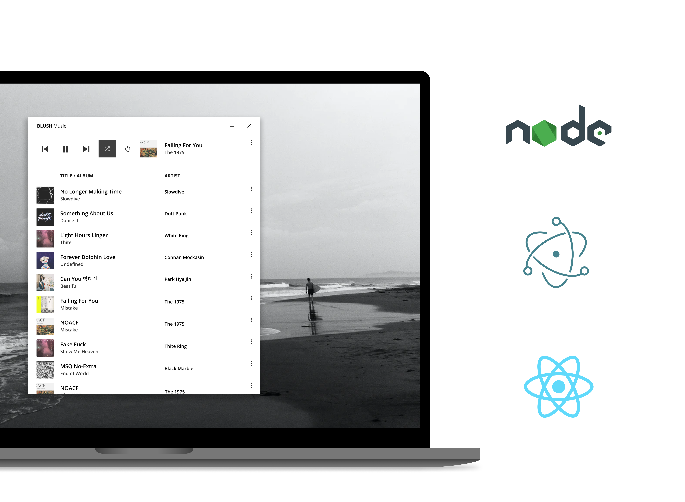

## Blush

**Developed with [ElectronJS]**  

## Documentation

- [NodeJS] - Node.js® is a JavaScript runtime built on Chrome's V8 JavaScript engine.
- [ReactJS] - A JavaScript library for building user interfaces
- [ElectronJS] - Build cross-platform desktop apps with JavaScript, HTML, and CSS
- [TypeScript] - TypeScript extends JavaScript by adding types to the language.
- [Stylus] - CSS Preprocessor

[NodeJS]: <https://nodejs.org/en/>
[ReactJS]: <https://reactjs.org/>
[ElectronJS]: <https://www.electronjs.org/>
[TypeScript]: <https://www.typescriptlang.org/>
[Stylus]: <https://stylus-lang.com/>